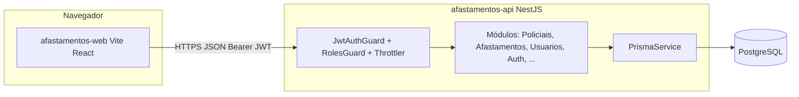
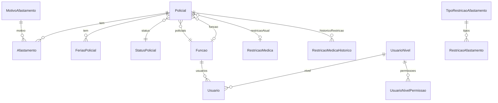

# Arquitetura do sistema — Sentinela (Gestão de Pessoal — COPOM)

Este documento descreve a arquitetura de software e de dados do repositório **controle-equipes**, composto pelo backend **afastamentos-api**, pelo frontend **afastamentos-web** e pela infraestrutura local de banco (PostgreSQL via Docker).

---

## 1. Visão geral

O sistema **“Sistema Sentinela de Gestão de Pessoal - COPOM”** é uma aplicação web para cadastro e gestão de **policiais**, **afastamentos**, **férias**, **restrições médicas**, **usuários**, **níveis de acesso com permissões por tela**, **restrições de afastamento** (janelas em que determinados motivos ficam bloqueados), relatórios e logs operacionais (auditoria, acessos, erros, geração de relatórios).

### 1.1 Stack tecnológica

| Camada | Tecnologia |
|--------|------------|
| API | **NestJS** 11, **TypeScript**, **Prisma** 7 (cliente + adapter `pg`) |
| Banco | **PostgreSQL** 16 (imagem Alpine via Docker Compose) |
| Autenticação | **JWT** (`@nestjs/jwt`, `passport-jwt`), senha com **bcryptjs** |
| Web | **React** 19, **Vite** 7, **TypeScript**, **MUI** 7 (Material + Emotion) |
| Validação API | `class-validator` / `class-transformer`, `ValidationPipe` global |
| Segurança HTTP | **Helmet** (CSP em produção), **CORS** configurável, **Throttler** (rate limit) |

### 1.2 Diagrama lógico (alto nível)



---

## 2. Organização do repositório

```
controle-equipes/
├── package.json              # Scripts raiz: docker, install:all, start:api, start:web, setup:db
├── docker-compose.yml        # Serviço postgres (porta 5432, volume persistente)
├── afastamentos-api/         # Backend NestJS
│   ├── prisma/
│   │   ├── schema.prisma     # Modelo de dados e enums
│   │   ├── migrations/       # Migrações versionadas
│   │   └── seed.ts           # Dados iniciais (níveis, equipes, perguntas, etc.)
│   └── src/                  # Código da API (módulos Nest)
└── afastamentos-web/         # SPA React
    └── src/
        ├── App.tsx           # Shell: auth, abas, permissões, lazy sections
        ├── api.ts            # Cliente HTTP + cache curto + token/acessoId
        ├── types.ts          # Tipos alinhados ao contrato da API
        ├── components/       # auth, common, sections
        ├── constants/        # TABS (telas), labels de status, utilitários de UI
        ├── theme/            # Tema MUI
        └── utils/            # datas, permissões, ordenação, etc.
```

---

## 3. Backend (`afastamentos-api`)

### 3.1 Bootstrap e preocupações transversais

- **`main.ts`**: executa `ensureInitialUser()` antes de subir o app; body JSON até **10MB** (fotos em base64); **Helmet**; **CORS** (localhost Vite + `FRONTEND_URL`); `ValidationPipe` global (`whitelist`, `forbidNonWhitelisted`, `transform`); porta padrão **3002** (`PORT`).
- **`app.module.ts`**: carrega módulos de domínio; registra **guards globais** `JwtAuthGuard`, `RolesGuard`, `ThrottlerGuard` e o filtro global `HttpExceptionFilter` (integrado ao serviço de erros).

### 3.2 Autenticação e autorização

- **JWT**: payload inclui `sub` (id do usuário), `matricula`, `isAdmin`, `acessoId` (para fechar sessão no log de acessos). Expiração configurada em **24h**.
- **`JwtAuthGuard`**: ignora autenticação em rotas marcadas com `@Public()`.
- **`RolesGuard`**:
  - Rotas `@Public()` liberadas.
  - `@AnyAuthenticated()` permite qualquer usuário autenticado (ex.: `GET /usuarios/niveis/:id/permissoes`, `GET /usuarios/funcoes`, `GET /usuarios/equipes`).
  - Se não há `@Roles()`, qualquer usuário autenticado passa.
  - Com `@Roles(...)`, exige que o **nome do nível** do usuário (`user.nivel.nome`) esteja na lista **ou** que seja administrador (`isAdmin` ou nível `ADMINISTRADOR`).
- **Recuperação de senha**: fluxo por pergunta de segurança (`/auth/forgot-password`, `/auth/reset-password-by-security-question`), com throttle mais restrito que o restante da API.

### 3.3 Módulos Nest (domínio)

| Módulo | Responsabilidade principal |
|--------|---------------------------|
| **AuthModule** | Login, JWT, integração com log de acesso |
| **PoliciaisModule** | CRUD policial, status, funções no contexto policial, férias, restrição médica, upload PDF/Excel, criação em lote, relatórios de efetivo por posto |
| **AfastamentosModule** | CRUD afastamentos, motivos, filtros por policial/equipe/período |
| **UsuariosModule** | Usuários, níveis, **permissões por tela** (`UsuarioNivelPermissao`), funções (catálogo), equipes (catálogo), perguntas de segurança |
| **RestricoesAfastamentoModule** | Tipos de restrição e restrições por período/ano com lista de motivos bloqueados |
| **SvgModule** | Cadastro de **horários** usados em visualizações SVG (listagem pública de leitura; escrita restrita a ADMINISTRADOR/SAD) |
| **AuditModule** | Consulta de `AuditLog` (CREATE/UPDATE/DELETE em entidades) |
| **RelatoriosModule** | Registro e listagem de geração de relatórios (`RelatorioLog`) |
| **ErrosModule** | Listagem de erros persistidos pelo filtro global |
| **AcessosModule** | Registro de login/logout e listagem de sessões (`AcessoLog`) |
| **HealthModule** | `GET /health/db` público — teste de conectividade com o banco |

Serviços auxiliares incluem **auditoria** (`AuditService`), **processamento de arquivo** para policiais (`ArquivoProcessorService` — PDF/Excel), e **Prisma** como única camada de persistência tipada.

### 3.4 Superfície da API (resumo por prefixo)

Rotas abaixo assumem base `http://<host>:<porta>/` (sem path global prefix no código analisado).

**Públicas (`@Public`)**

- `POST /auth/login`, `POST /auth/forgot-password`, `POST /auth/reset-password-by-security-question`
- `GET /health/db`
- `GET /` — resposta simples do `AppController`

**Autenticadas (JWT)** — exemplos representativos:

- **`/policiais`**: listagem paginada e filtros avançados; `GET` de catálogos auxiliares; criação/edição/remoção com `@Roles('ADMINISTRADOR', 'SAD')` onde aplicado; `POST /policiais/upload` (multipart); `POST /policiais/bulk`; endpoints de férias, status, restrições médicas, efetivo por posto, etc.
- **`/afastamentos`**: CRUD; `GET/POST/PATCH/DELETE /afastamentos/motivos`.
- **`/usuarios`**: controlador inteiro com `@Roles('ADMINISTRADOR', 'SAD')`, exceto endpoints marcados `@AnyAuthenticated` (permissoes, funções ativas para selects, equipes).
- **`/restricoes-afastamento`**: CRUD de restrições; CRUD de tipos em `/restricoes-afastamento/tipos`.
- **`/svg/horarios`**: leitura para todos autenticados; escrita apenas ADMINISTRADOR/SAD.
- **`/audit/logs`**, **`/relatorios/*`**, **`GET /erros`**, **`GET /acessos`**: restritos a **`@Roles('ADMINISTRADOR', 'COMANDO')`** (como declarado nos controladores).
- **`POST /acessos/logout`**: usado pelo frontend para finalizar `AcessoLog` (não exige role COMANDO na classe; apenas JWT).

A granularidade fina do que cada perfil faz **nas telas** vem de `UsuarioNivelPermissao` no banco; o `RolesGuard` da API protege **grupos de endpoints** (admin/SAD/comando), não cada botão.

---

## 4. Modelo de dados (Prisma / PostgreSQL)

Fonte de verdade: `afastamentos-api/prisma/schema.prisma`.

### 4.1 Entidades nucleares

- **Policial**: dados pessoais/profissionais, vínculo com **StatusPolicial**, **Funcao**, **RestricaoMedica** opcional, equipe (string), foto, auditoria de criação/edição, campos de desativação.
- **StatusPolicial**, **Funcao**: catálogos; `Funcao` também associada a **Usuario**.
- **FeriasPolicial**: período por ano, confirmação/reprogramação, unicidade `(policialId, ano)`.
- **Afastamento**: vínculo a **Policial** e **MotivoAfastamento**; SEI, datas, `AfastamentoStatus` (ATIVO / ENCERRADO).
- **MotivoAfastamento**: catálogo de motivos.

### 4.2 Usuários, níveis e permissões de interface

- **Usuario**: matrícula única, hash de senha, pergunta/resposta de segurança, equipe, `UsuarioStatus`, `isAdmin`, vínculos opcionais a **UsuarioNivel** e **Funcao**, foto.
- **UsuarioNivel**: nome único (ex.: ADMINISTRADOR, SAD, COMANDO, OPERAÇÕES — conforme seed), flag `ativo`.
- **UsuarioNivelPermissao**: para cada nível, combinações (`telaKey`, `PermissaoAcao`) — ações: **VISUALIZAR**, **EDITAR**, **DESATIVAR**, **EXCLUIR**. O frontend usa `telaKey` alinhada às chaves em `afastamentos-web/src/constants/index.ts` (`dashboard`, `calendario`, `afastamentos-mes`, etc.) e chaves extras para relatórios (`relatorios-sistema`, `relatorios-servico`).

### 4.3 Restrições médicas e de afastamento

- **RestricaoMedica** + **RestricaoMedicaHistorico**: histórico de períodos em que o policial teve determinada restrição.
- **TipoRestricaoAfastamento** + **RestricaoAfastamento**: define intervalos por ano com `motivosRestritos` (array de IDs de motivo) e flag `ativo`.

### 4.4 Catálogos e parametrização

- **EquipeOption**: equipes nomeadas (seed cria A–E, SEM_EQUIPE).
- **PerguntaSeguranca**: perguntas ativas para cadastro/recuperação.
- **HorarioSvg**: faixas `horaInicio` / `horaFim` (strings HH:mm) para uso em SVG.

### 4.5 Logs e auditoria

- **AuditLog**: entidade, id, ação (CREATE/UPDATE/DELETE), usuário, snapshots `before`/`after` (JSON).
- **RelatorioLog**: quem gerou qual tipo de relatório.
- **ErroLog**: erros da aplicação (mensagem, stack, request, usuário, etc.) — alimentado pelo filtro HTTP.
- **AcessoLog**: entrada/saída, IP, user-agent, duração da sessão em segundos.

### 4.6 Enums

- **AfastamentoStatus**: ATIVO, ENCERRADO.
- **UsuarioStatus**: ATIVO, DESATIVADO.
- **PermissaoAcao**: VISUALIZAR, EDITAR, DESATIVAR, EXCLUIR.
- **AuditAction**: CREATE, UPDATE, DELETE.

### 4.7 Diagrama entidade-relacionamento (simplificado)



---

## 5. Frontend (`afastamentos-web`)

### 5.1 Composição da aplicação

- **`main.tsx`**: monta a árvore com `ThemeProvider` (MUI) e `CssBaseline`.
- **`App.tsx`**:
  - Sem usuário: fluxo **Login** → **Esqueci senha** → **Pergunta de segurança**.
  - Com usuário: cabeçalho, avatar com upload de foto (crop, base64 via API), logout.
  - Carrega **permissões** com `GET /usuarios/niveis/:nivelId/permissoes` e monta abas a partir de `TABS` filtrando quem tem `VISUALIZAR`.
  - Troca de aba renderiza **seções lazy** (`React.lazy` + `Suspense`): dashboard, calendário, afastamentos do mês, cadastros, equipe, usuários, gestão do sistema, relatórios, restrição de afastamento.
  - Evento customizado `nivel-permissoes-atualizadas` força recarga das permissões quando níveis são alterados na UI.

### 5.2 Cliente HTTP (`api.ts`)

- Base URL: `import.meta.env.VITE_API_URL` ou fallback `//<hostname>:3002`.
- Token JWT e `acessoId` em **sessionStorage** (chaves prefixadas `afastamentos-web:`).
- `fetch` com header `Authorization: Bearer …`; tratamento de erros JSON; cache em memória com TTL curto (30s) para algumas leituras.
- Métodos espelham os recursos do backend (usuários, policiais, afastamentos, logs, etc.).

### 5.3 Organização de componentes

- **`components/auth/`**: telas de autenticação e recuperação.
- **`components/common/`**: diálogos, cropper de imagem, etc.
- **`components/sections/`**: cada “tela” principal do sistema (dashboards, tabelas, formulários).
- **`utils/permissions.ts`**: helpers para checar ações por tela no cliente (complementar ao backend).

---

## 6. Infraestrutura e operações

- **Docker Compose** (`docker-compose.yml`): um serviço `postgres` com variáveis `POSTGRES_*` (padrões `postgres` / `postgres123` / `afastamentos_db`), volume nomeado para dados.
- **Scripts úteis na raiz**: `npm run db:up` / `db:down`, `start:api`, `start:web`, `install:all`, `setup:db` (via API: generate + migrate + seed).
- **Variáveis de ambiente típicas (API)**: `DATABASE_URL`, `JWT_SECRET` (obrigatório em produção), `NODE_ENV`, `PORT`, `FRONTEND_URL`, `API_URL` (CSP `connectSrc` em produção).
- **Frontend**: `VITE_API_URL` para apontar a API em ambientes não locais.

---

## 7. Fluxos que amarram backend e frontend

1. **Login**: `POST /auth/login` → token + `acessoId` + dados do usuário → sessão no navegador → `GET /usuarios/:id` (ou payload) para estado do usuário.
2. **Autorização de UI**: permissões persistidas em `UsuarioNivelPermissao` → frontend só exibe abas/ações permitidas; API continua validando papéis em endpoints sensíveis.
3. **Logout**: `POST /acessos/logout` com `acessoId` → atualiza `AcessoLog`; limpeza de storage no cliente.
4. **Afastamentos com regras de negócio**: serviços de afastamentos/policiais aplicam validações (ex.: restrições por período, motivos); detalhes ficam nos serviços TypeScript correspondentes.

---

## 8. Manutenção deste documento

O código evolui; em caso de divergência, prevalecem:

1. `afastamentos-api/prisma/schema.prisma` para o **modelo de dados**;
2. Controladores em `afastamentos-api/src/**/**/*.controller.ts` para **rotas e papéis**;
3. `afastamentos-web/src/constants/index.ts` (`TABS` / `TabKey`) para **chaves de tela** usadas em permissões;
4. `afastamentos-web/src/api.ts` para o **contrato consumido pelo cliente**.

---

*Documento gerado com base na análise do repositório controle-equipes (backend NestJS + frontend React/Vite + Prisma/PostgreSQL).*
