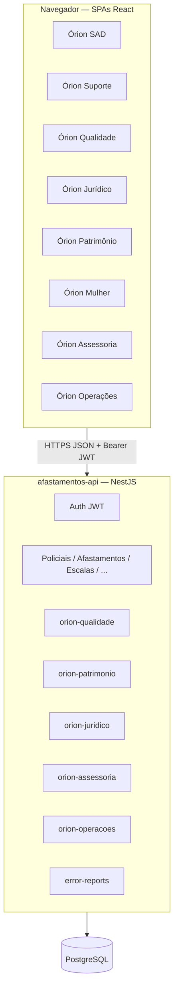

# Sistema Órion — Ecossistema COPOM

Plataforma integrada de apoio operacional e administrativo ao COPOM: **um backend (API)**, **PostgreSQL** e **várias aplicações web (SPAs)** que compartilham autenticação e perfil de usuário. O repositório `controle-equipes` concentra o código desses projetos.

---

## Sumário

1. [Visão geral](#1-visão-geral)
2. [Ecossistema — sistemas individuais](#2-ecossistema--sistemas-individuais)
3. [Arquitetura lógica](#3-arquitetura-lógica)
4. [Backend único (`afastamentos-api`)](#4-backend-único-afastamentos-api)
5. [Autenticação, sessão e navegação entre apps](#5-autenticação-sessão-e-navegação-entre-apps)
6. [Autorização: níveis, telas e “sistemas permitidos”](#6-autorização-níveis-telas-e-sistemas-permitidos)
7. [Modelagem de dados (Prisma / PostgreSQL)](#7-modelagem-de-dados-prisma--postgresql)
8. [Fluxos operacionais principais](#8-fluxos-operacionais-principais)
9. [Ambiente de desenvolvimento](#9-ambiente-de-desenvolvimento)
10. [Deploy, segurança e observabilidade](#10-deploy-segurança-e-observabilidade)
11. [Licença](#11-licença)

---

## 1. Visão geral

O **Órion** organiza informações de pessoal (policiais), afastamentos, férias, escalas, trocas de serviço, restrições, patrimônio, qualidade, chamados de suporte e módulos em expansão (Jurídico, Operações, Assessoria, Mulher). O **núcleo operacional** vive no app **Órion SAD** (`afastamentos-web`). Os demais apps são **módulos de domínio** ou **fachadas** que consomem a mesma API e o mesmo cadastro de usuários.

**Stack principal**

| Camada | Tecnologia |
|--------|------------|
| API | NestJS (TypeScript), Passport JWT |
| Persistência | PostgreSQL, Prisma ORM |
| Frontends | React (Vite), MUI |
| Infra local (DB) | Docker Compose (`postgres:16-alpine`) |

---

## 2. Ecossistema — sistemas individuais

Cada pasta na raiz do monorepo é um pacote npm independente, exceto o `package.json` raiz que orquestra scripts de desenvolvimento.

| Pasta | Nome de produto | Papel | Porta dev (padrão) |
|-------|-----------------|--------|---------------------|
| `afastamentos-api` | API Órion | **Única API HTTP** do ecossistema: auth, SAD, escalas, suporte, qualidade, patrimônio, placeholders | `3002` (`PORT`) |
| `afastamentos-web` | **Órion SAD** | Sistema de afastamentos, efetivo, escalas, relatórios, administração de usuários/níveis | `5173` |
| `orion-suporte-web` | **Órion Suporte** | Gestão de chamados (`ErrorReport`): protocolo, status, comentários, fila admin | `5180` |
| `orion-qualidade-web` | **Órion Qualidade** | Registros de qualidade / não conformidade leve (`QualidadeRegistro`) | `5182` |
| `orion-juridico-web` | **Órion Jurídico** | SPA estrutural; API com endpoints mínimos / reservados para evolução | `5183` |
| `orion-patrimonio-web` | **Órion Patrimônio** | Cadastro e situação de bens (`PatrimonioBem`) | `5184` |
| `orion-mulher-web` | **Órion Mulher** | SPA (violência doméstica / documentos — em evolução); permissão `ORION_MULHER`; sem módulo dedicado na API ainda | `5185` |
| `orion-assessoria-web` | **Órion Assessoria** | SPA estrutural; API placeholder | `5186` |
| `orion-operacoes-web` | **Órion Operações** | SPA estrutural; API placeholder | `5187` |

**Identificadores de sistema** usados em `Usuario.sistemasPermitidos` (e constantes na API) incluem: `SAD`, `OPERACOES`, `ORION_QUALIDADE`, `ORION_JURIDICO`, `ORION_PATRIMONIO`, `ORION_MULHER`, `ORION_ASSESSORIA`. O **Órion Suporte** usa combinação de nível (`UsuarioNivel.acessoOrionSuporte`) e flag por usuário (`Usuario.acessoOrionSuporte`), não apenas um ID na lista de sistemas.

Jurídico, Assessoria e Operações expõem na API rotas públicas de “meta” e rotas autenticadas de “sessão/resumo” preparadas para crescimento do domínio.

---

## 3. Arquitetura lógica



- **Não há microsserviços** por domínio: módulos Nest (`OrionQualidadeModule`, etc.) compartilham `PrismaService` e o mesmo schema.
- **Frontends** são estáticos; toda regra de negócio sensível fica na API.

---

## 4. Backend único (`afastamentos-api`)

### 4.1 Módulos Nest (domínios)

| Módulo | Responsabilidade resumida |
|--------|---------------------------|
| `AuthModule` | Login, JWT, recuperação de senha, `GET /auth/me` |
| `PoliciaisModule` | CRUD policial, status, função, restrição médica, foto |
| `AfastamentosModule` | Afastamentos, motivos, encerramento automático |
| `EscalasModule` | Parâmetros, SVG/horários, escalas geradas, extraordinárias |
| `TrocaServicoModule` | Trocas 12×24 entre policiais |
| `RestricoesAfastamentoModule` | Restrições por ano/motivo |
| `UsuariosModule` | Usuários, níveis, permissões por tela |
| `SvgModule` | Horários para geração visual |
| `RelatoriosModule` | Emissão / logs de relatórios |
| `AuditModule` | `AuditLog` |
| `ErrosModule` | Log de erros HTTP, filtro global |
| `AcessosModule` | Sessões (`AcessoLog`) |
| `ErrorReportsModule` | Chamados de suporte |
| `OrionQualidadeModule` | Prefixo `orion-qualidade/*` |
| `OrionPatrimonioModule` | Prefixo `orion-patrimonio/*` |
| `OrionJuridicoModule` | Prefixo `orion-juridico/*` (placeholder) |
| `OrionAssessoriaModule` | Prefixo `orion-assessoria/*` (placeholder) |
| `OrionOperacoesModule` | Prefixo `orion-operacoes/*` (placeholder) |
| `HealthModule` | Saúde da aplicação |

### 4.2 Guards globais (`app.module.ts`)

1. **`JwtAuthGuard`** — exige JWT salvo em `Authorization: Bearer`, exceto rotas `@Public()`.
2. **`RolesGuard`** — se não houver `@Roles()`, qualquer usuário autenticado acessa; `@Roles('ADMINISTRADOR', …)` restringe por nome do nível; admin ou nível `ADMINISTRADOR` liberam tudo.
3. **`ThrottlerGuard`** — limite global (ex.: 300 req/min); login tem throttle mais restrito no controller.

Decorators importantes: `@Public()`, `@AnyAuthenticated()`, `@Roles()`, `@CurrentUser()`.

### 4.3 Configuração

- Variáveis via **`afastamentos-api/.env`** (`ConfigModule` com `envFilePath` fixo relativo ao build).
- **`main.ts`**: body JSON até 10MB (anexos base64 em chamados), Helmet (CSP em produção), CORS: em **desenvolvimento** `origin: true`; em **produção** lista fixa + `FRONTEND_URL` + `ORION_SUPORTE_FRONTEND_URL`. Novas origens de SPAs em produção exigem atualizar env/lista.

---

## 5. Autenticação, sessão e navegação entre apps

### 5.1 Login

1. `POST /auth/login` com matrícula e senha.
2. Resposta inclui **JWT** e metadados de sessão; o front grava o token e o id de acesso quando aplicável.
3. `GET /auth/me` devolve o perfil (sem hash de senha) para bootstrap dos apps que não carregam `GET /usuarios/:id`.

### 5.2 Armazenamento do token (ecossistema)

Arquivo de referência: `afastamentos-web/src/constants/orionEcossistemaAuth.ts` (replicado nos outros apps).

- Chaves em **`sessionStorage`**: `orion-ecossistema:jwt` e `orion-ecossistema:acessoId` (nomes configuráveis por `VITE_ORION_AUTH_*`).
- **Mesma origem** (ex.: proxy reverso unificando path): sessão compartilhada automaticamente.
- **Origens diferentes** (ex.: dev em portas distintas): ao mudar de sistema, a aplicação monta URL com **handoff no fragmento** `#orion_sso=<jwt>` (o fragmento não vai ao servidor), o destino lê, grava no `sessionStorage` e limpa a URL.

Função típica: `buildUrlComHandoffJwt(urlBase, token)`.

### 5.3 Pós-login no SAD

O fluxo de **seleção de sistema** (`SelecionarSistemaView`, `sistemaDestinos.ts`) decide se o usuário entra direto no SAD ou é redirecionado/handoff para outro app conforme `sistemasPermitidos` e URLs `VITE_*` de cada módulo.

---

## 6. Autorização: níveis, telas e “sistemas permitidos”

### 6.1 Administrador e nível

- `Usuario.isAdmin` ou nível nomeado **`ADMINISTRADOR`** bypassa checagens de `@Roles()` no `RolesGuard`.
- Demais usuários têm `UsuarioNivel` com registros em **`UsuarioNivelPermissao`**: tupla `(nivelId, telaKey, acao)` com `acao ∈ { VISUALIZAR, EDITAR, DESATIVAR, EXCLUIR }`.

### 6.2 Sistemas externos (SPAs)

O array **`Usuario.sistemasPermitidos`** lista strings (`SISTEMAS_EXTERNOS_IDS` na API). Isso **não substitui** o JWT: apenas informa quais **fronts** o usuário pode abrir e quais **prefixos** de API de módulo Órion podem ser usados (os serviços checam presença de `ORION_QUALIDADE`, `ORION_PATRIMONIO`, etc.).

### 6.3 Órion Suporte

Acesso efetivo combina:

- `UsuarioNivel.acessoOrionSuporte`, e/ou
- `Usuario.acessoOrionSuporte` (override tri-state: null = herda do nível; true/false força).

Chamados: modelo **`ErrorReport`** com protocolo, status, categoria, histórico em JSON (`acoes`), anexo opcional.

---

## 7. Modelagem de dados (Prisma / PostgreSQL)

Trecho conceitual; o detalhe canônico está em `afastamentos-api/prisma/schema.prisma`.

### 7.1 Núcleo SAD (pessoal e afastamentos)

- **`Policial`**: identidade, vínculos `StatusPolicial`, `Funcao`, `RestricaoMedica`, equipe, auditoria, desativação.
- **`Afastamento`**, **`MotivoAfastamento`**, enum **`AfastamentoStatus`**.
- **`FeriasPolicial`**: férias por ano, flags de confirmação/reprogramação.
- **`TrocaServico`**: pares A/B, datas de serviço, turno, restauração.
- **`RestricaoAfastamento`** / **`TipoRestricaoAfastamento`**: janelas por ano com motivos restritos.

### 7.2 Escalas

- **`EscalaParametro`**, **`HorarioSvg`**, **`EscalaInformacao`**.
- **`EscalaGerada`** + **`EscalaGeradaLinha`**: snapshot de escalas salvas (operacional, expediente, motoristas, extraordinária).
- **`PolicialContagemEscalaExtra`**: contagem por policial em escalas extraordinárias persistidas.

### 7.3 Funções e equipes

- **`Funcao`**: flags `escalaOperacional`, `escalaMotorista`, `escalaExpediente`, `vinculoEquipe`, preset de expediente (`FuncaoExpedienteHorarioPreset`), `equipeReferencia`.
- **`PolicialExpediente12x36Fase`**: fase par/ímpar para 12×36 semanal.
- **`EquipeOption`**: catálogo de equipes.

### 7.4 Usuários e segurança

- **`Usuario`**, **`UsuarioNivel`**, **`UsuarioNivelPermissao`**, **`PerguntaSeguranca`**.
- Arrays e flags já descritos na seção 6.

### 7.5 Módulos Órion com tabelas dedicadas

- **Qualidade**: `QualidadeRegistro` + enum `QualidadeRegistroStatus`.
- **Patrimônio**: `PatrimonioBem` + enum `PatrimonioBemSituacao`.
- **Suporte**: `ErrorReport`, enums de status/categoria, `ErrorReportProtocolSequence`.

### 7.6 Auditoria e logs

- **`AuditLog`**, **`RelatorioLog`**, **`ErroLog`**, **`AcessoLog`**.

---

## 8. Fluxos operacionais principais

### 8.1 Cadastro de policial e afastamento

Operador com permissão nas telas do SAD → API valida conflitos/regras → gravacao em `Policial` / `Afastamento` → auditoria quando aplicável.

### 8.2 Geração de escala

Leitura de parâmetros, funções, afastamentos ativos, SVG → geração em memória → opção de **persistir** `EscalaGerada` com linhas denormalizadas para impressão/consulta.

### 8.3 Troca de serviço

Dois policiais, datas e turnos; status `ATIVA` até conclusão/cancelamento; campos de restauração de equipe.

### 8.4 Qualidade / Patrimônio

Usuário com sistema permitido abre o SPA → mesmo JWT → chamadas `GET/POST/PATCH` sob `/orion-qualidade/v1/...` ou `/orion-patrimonio/v1/...` → serviço valida `sistemasPermitidos` antes de tocar nas tabelas.

### 8.5 Suporte

Usuário abre chamado (`POST /error-reports`) com possível anexo base64; administradores com permissão de negócio nas rotas `admin/*` tratam fila e status.

---

## 9. Ambiente de desenvolvimento

### 9.1 Pré-requisitos

- Node.js compatível com os `package.json` (TypeScript 5.9 / Vite 7 nos fronts).
- Docker Desktop (para PostgreSQL via Compose).

### 9.2 Banco de dados

```bash
npm run db:up
```

Sobe `postgres` na porta **5432** (usuário/senha/db configuráveis por env no `docker-compose.yml`).

Setup guiado (instala dependências, migrations, seed opcional): `npm run setup` na raiz — ver `setup.js`.

Migrations/seed Prisma: scripts em `afastamentos-api/package.json` (`db:setup`, `prisma migrate`, etc.).

### 9.3 Rodar API + todos os fronts

Na raiz do repositório:

```bash
npm run install:all
npm run start:full
```

- **`start:full`** sobe **API + SAD + Suporte + Qualidade + Jurídico + Patrimônio + Mulher + Assessoria + Operações** via `concurrently`.
- **Não** rode `start:api` em paralelo com `start:full` (porta da API).
- Se a API já estiver rodando: `npm run start:full:without-api`.

Portas padrão (também descritas no `package.json` raiz):

| Serviço | Porta |
|---------|-------|
| API | 3002 |
| SAD | 5173 |
| Suporte | 5180 |
| Qualidade | 5182 |
| Jurídico | 5183 |
| Patrimônio | 5184 |
| Mulher | 5185 |
| Assessoria | 5186 |
| Operações | 5187 |

Cada SPA usa `VITE_API_URL` apontando para a API (ex.: `http://localhost:3002`).

### 9.4 Monorepo

Não há workspaces npm obrigatórios: cada pasta tem seu próprio `node_modules`. O `install:all` na raiz encadeia `npm install` em todas as pastas.

---

## 10. Deploy, segurança e observabilidade

- **Produção**: configurar `NODE_ENV=production`, `FRONTEND_URL`, URLs dos outros fronts se necessário, e revisar CORS em `main.ts`.
- **Helmet + CSP**: `connectSrc` deve incluir a origem da API e dos fronts que fazem fetch.
- **JWT**: armazenado no cliente em `sessionStorage` — mitigar XSS nos fronts; CSP restringe scripts.
- **Rate limit**: throttling global + rotas sensíveis (`auth/login`, etc.).
- **Logs**: `ErroLog`, `AcessoLog`, `AuditLog`, `RelatorioLog` conforme uso da API.

---

## 11. Licença

Projeto **privado** — todos os direitos reservados.

---

## Créditos

Desenvolvido no contexto operacional do **COPOM**, com foco em missão, rastreabilidade e evolução modular dos domínios Órion.
